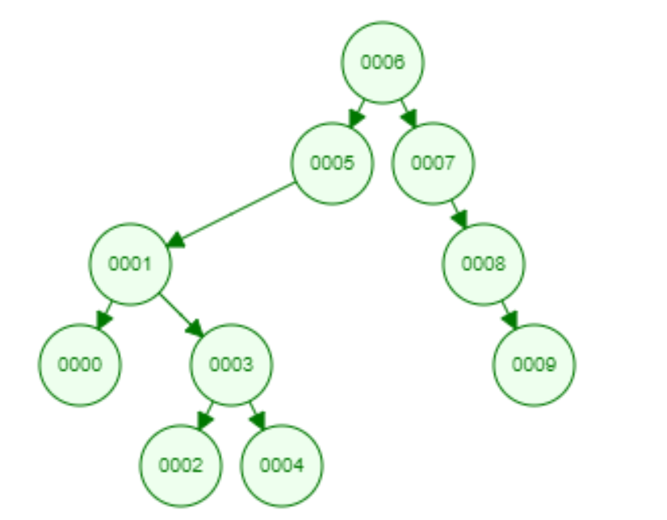

# Binary-Search-Tree-Projesi
Veri Yapıları ve Algoritmalar proje 3

* [7, 5, 1, 8, 3, 6, 0, 9, 4, 2] dizisinin Binary-Search-Tree aşamalarını yazınız.

* [7, 5, 1, 8, 3, 6, 0, 9, 4, 2] root 6 olsun

# 1.

